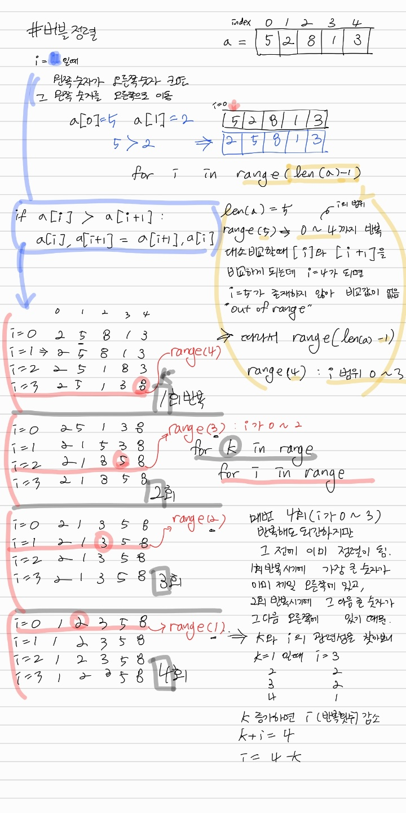
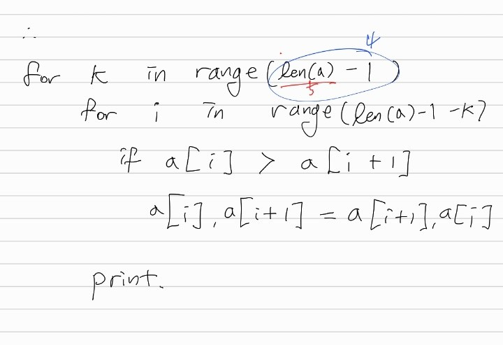

# 정렬 알고리즘

## bubble sort
- 예시
```python
# sort 사용하지 않고 오름차순 정렬하기
data = [5,2,8,1,3]

dataNum = len(data)

for k in range(dataNum):
  for i in range(dataNum-1-k): # 각 회차의 반복 횟수는 직전 회차만큼 줄어들어야 함. 회차가 진행될 때마다 뒤에서부터 한개씩 정렬이 완료되기 때문
    if data[i] > data[i+1]:
      data[i],data[i+1] = data[i+1], data[i]

print(data)
```




