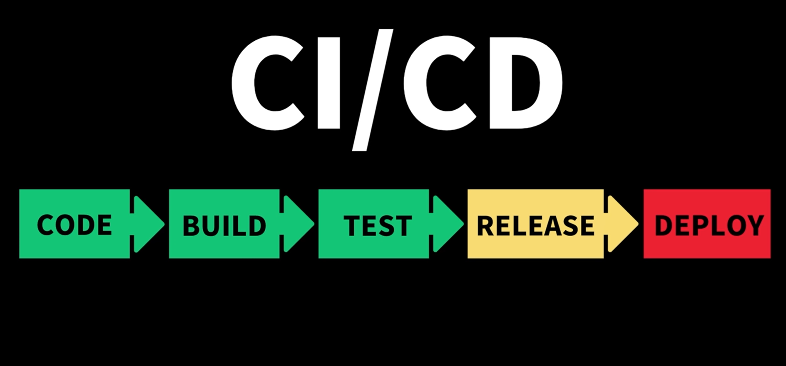
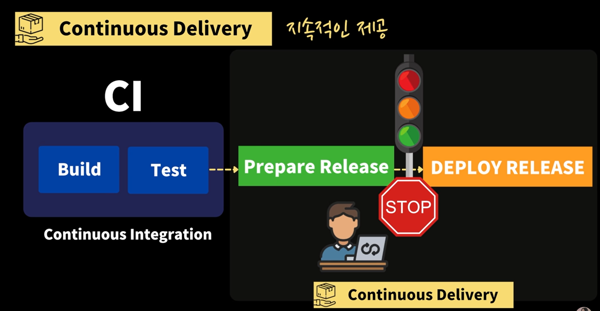

## CI/CD
- CI/CD는 어플리케이션 개발부터 배포까지 모든 단계의 `자동화`를 통해 효율적이고 빠른 배포를 가능하게 하는 시스템이다.

 

#### 1. CI(Continuous Integration : 지속적인 통합)
- 개발자들이 코드 변경 사항을 주기적으로 메인 레포지토리에 병합하여 빌드 및 테스트하는 것을 의미한다.
- 1991년에 처음 사용된 CI는 익스트림 프로그래밍개발 방법론에 채택되어 발전하였고, 코드 변경의 충돌 문제를 줄여준다.
- 1. 코드 변경 사항을 주기적으로 빈번하게 머지해야 한다 : 각자 오래 작업을 하다가 나중에 머지하려고 하면 코드 통합에 어려움을 겪을 수 있다. 최대한 작은 단위로 나눠서 개발/통합하는 것이 중요하다.
- 2. 통합을 위한 단계(빌드, 테스트, 머지)의 자동화 : 주기적으로 머지된 코드 변경 사항이 자동으로 빌드되고, 빌드가 성공적인지 확인되어야 한다. 또한 새로 추가된 코드와 기존 시스템의 버그 여부가 자동으로 테스트되어야 한다.

 

#### 1.1. CI/CD의 자동화 세부 과정
- 개발자들은 코드 변경사항을 주기적으로 생성하고 머지한다.(그 전에 코드 리뷰를 통해 코드의 적절성을 검증해야 한다.)
- 이후, 팀에서 만든 CI 스크립트를 통해 추가된 코드로 인해 빌드가 이루어지고, 다양한 테스트가 자동으로 실행된다.
- 빌드와 테스트가 정상적으로 처리되면 초록색 사인이 표시되고 무사히 통과된 것으로 판단된다.
- 그러나 새로 추가된 코드에 문제가 생기면 빌드가 실패하거나 테스트에서 실패하고 빨간색 경고 이미지가 표시된다.
- 문제를 일으킨 개발자는 알림을 자동으로 받게 된다.

 

### 1.2. CI 장점
- 주기적으로 브랜치를 합치기 때문에 충돌을 피할 수 있어 개발의 생산성이 높아진다.
- 모든 코드가 자동으로 빌드되고 테스트되므로 코드의 결함이나 문제점을 빠르게 발견할 수 있다.
- 발생하는 결함은 빠르게 수정 가능하다.(주기적으로 머지하기 위해 코드의 변경 사항이 작기 때문에 문제를 수정할 때 고립된 작은 단위의 문제를 확인할 수 있다.)
- 코드 퀄리티 향상(모든 개발자들이 자신이 새로 작성하는 코드에 한해서는 유닛 테스트를 꼭 포함해야하기 때문)

 

### 2. CD(Continuous Delivery : 지속적 제공)

- CI로 수행된 코드 변경 사항이 검증(test)을 거친 후 배포하는 단계에서 릴리즈 과정을 거치고, 준비된 릴리즈가 문제가 없는지 개발/검증팀이 직접 검증 후 **수동적**으로 배포한다.

 

### 3. CD(Continuous Deployment : 지속적 배포)

- 최종적으로 **자동으로** 사용자에게 배포할 수 있도록 설계된 과정이다. Continuous Delivery와는 다르게 배포 과정에서 릴리즈가 준비되자마자 자동으로 사용자에게 배포한다.

 

### 4. CI/CD 도구
- 젠킨스(Jenkins), Buildkite
- GitHub ACtions
- 각 회사에서 사용하는 도구 상이

