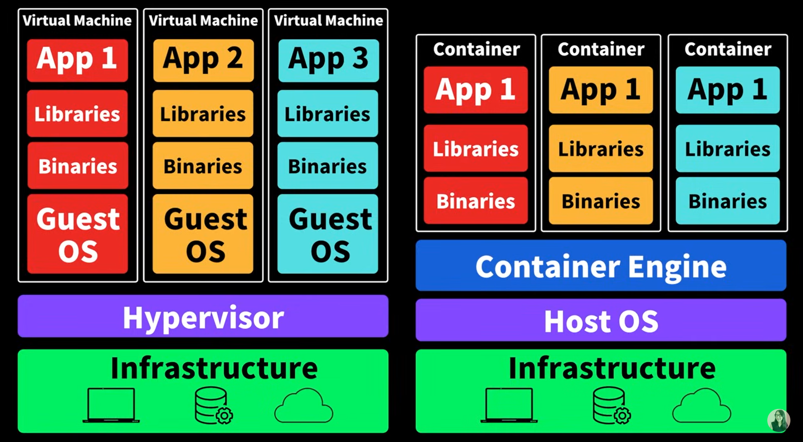
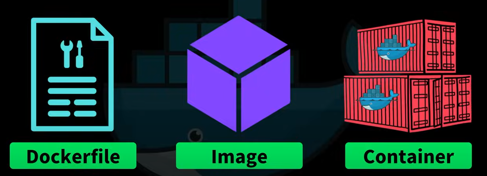
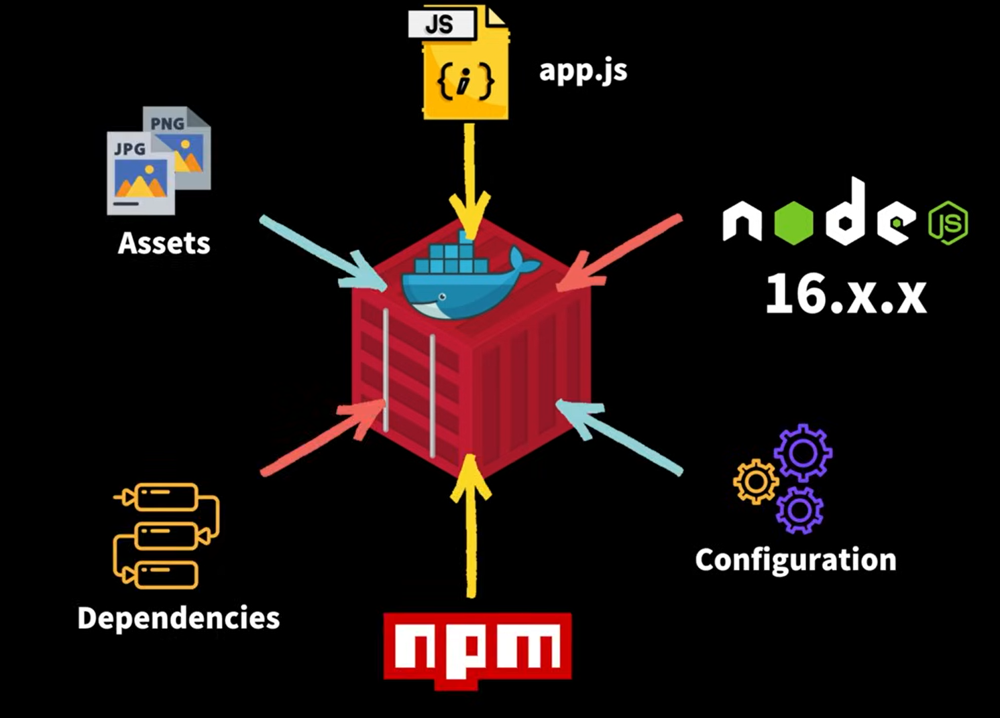
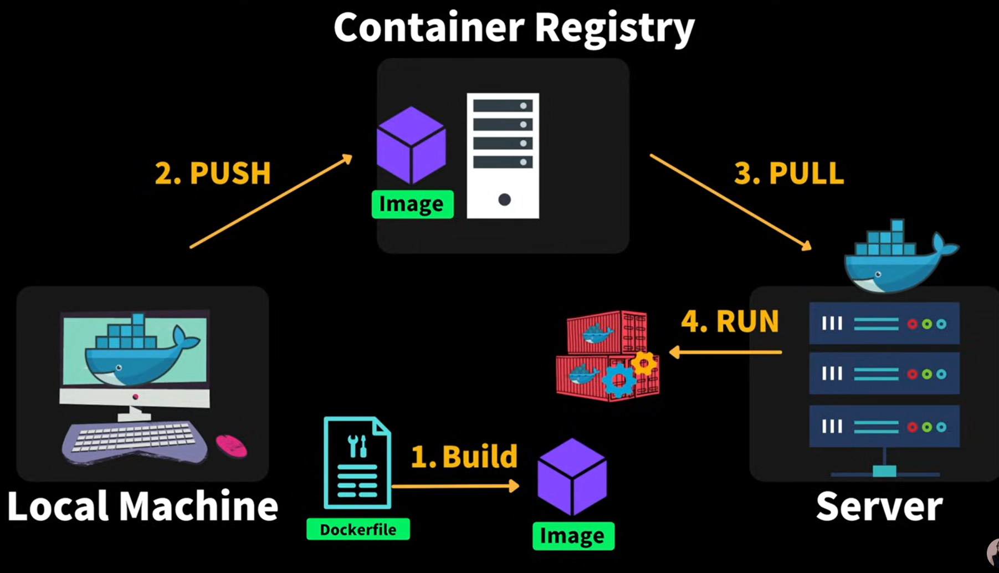
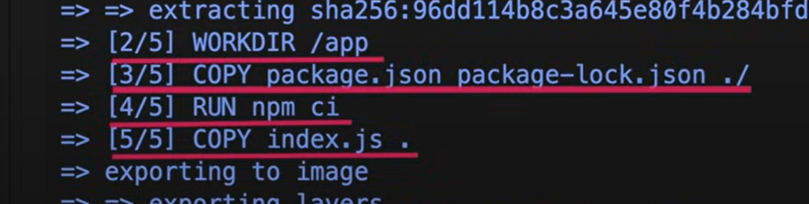
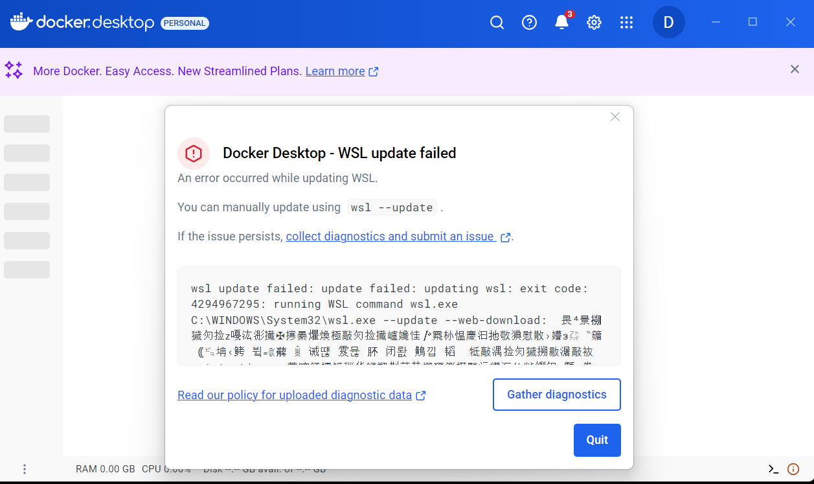
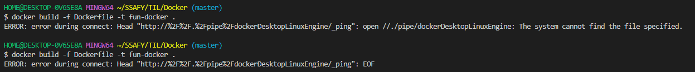

 ## 🐳 Docker 사용해보기
  
### 1. 도커의 필요성과 기능
- 도커는 애플리케이션과 필요한 시스템 환경 설정, 디펜던시(의존성)를 하나의 컨테이너 안에 묶어 배포와 구동을 쉽게 해주는 툴이다.
- 현대 애플리케이션은 여러 디펜던시와 환경 설정이 요구되며 소스 코드만 배포하는 것은 문제가 발생할 수 있다.
- 개발자들이 각자의 PC에 모든 것을 설치하고 설정하는 과정은 번거롭고 오류를 유발할 수 있는데, 도커는 모든 리소스를 컨테이너에 포함시켜 일관되게 실행할 수 있도록 지원하기 때문에 앞서 언급된 번거로움과 문제를 해결할 수 있다.
- 덕분에 사용자는 다양한 환경에서도 동일한 런타임 환경을 제공받아 쉽게 애플리케이션을 구동할 수 있다.

</br>

### 2. 도커와 VM의 비교

- 도커는 VM(Virtual Machine)과 유사하지만 **VM**은 하드웨어 위에 하이퍼바이저 소프트웨어를 통해 가상의 머신을 만들어 각각의 운영체제를 포함한다.
- **도커의 컨테이너**는 호스트 운영체제에서 컨테이너 엔진만 설치하면 고립된 환경에서 애플리케이션을 실행할 수 있도록 도와주기 때문에 VM보다 경량화 되어있다.
- VM은 **운영체제를 포함**하기 때문에 시스템 자원을 많이 소모하고 시작 시간이 길지만 컨테이너는 이러한 문제를 해결하는 경량 솔루션이다.
- 컨테이너가 구동되기 위해선 컨`테이너 엔진이 필수`이며 컨테이너 엔진이 호스트 OS에 접근해서 필요한 것 처리한다. 이 중 `도커`가 가장 많이 사용된다.

</br>

### 3. 도커와 컨테이너의 기본 개념

- 도커는 컨테이너를 만들고 배포하며 구동하는 툴이다. 이를 위해서는 `도커 파일(Dockerfile), 이미지(Image), 컨테이너(Container)` 세 가지가 필요하다.
- 컨테이너를 만들기 위해서는 먼저 도커 파일을 작성해야 하고, 이를 통해 이미지를 생성하여 컨테이너를 구동할 수 있다.

#### 3.1 도커 파일(Dockerfile)
- 도커 파일은 어플리케이션 구동에 필요한 환경 설정 및 의존성을 명시하는 설명서(레시피)다. 이 파일을 통해 이미지를 생성할 수 있다.
- 필요한 요소(애플리케이션 구동에 필요한 프레임워크나 라이브러리 설치 등)들을 명시할 수 있다.
- 외부 디펜던시와 필요 환경 변수 설정, 구동 스크립트 등이 포함될 수 있다.


##### 3.2 이미지(Image)
- 도커파일을 이용해 생성된 이미지는 애플리케이션을 실행하는 데 필요한 코드, 런타임 환경, 시스템 툴, 시스템 라이브러리 등을 포함한다. 실행되고 있는 어플리케이션의 상태를 스냅샷 한 것이므로 변경 불가능한 **불변**의 상태라고 볼 수 있다.

#### 3.3 컨테이너(Container)

- 컨테이너는 이미지를 고립된 환경에서 실행하는 단위로, 개별적인 파일 시스템 안에서 운영되도록 설계되어있다.
- 각각의 컨테이너는 이미지를 통해 어플리케이션을 구동하며 수정이 가능하지만 그 변경 사항은 원본 이미지에 영향을 주지 않는다.
- 이미지(Image)는 클래스에, 각 컨테이너(Container)는 그 클래스의 인스턴스로 비유할 수 있다.

</br>

### 4. 도커 이미지 공유 및 컨테이너 배포 방법

- 도커 이미지 배포 방법 : 로컬 머신에서 이미지를 생성한 뒤 컨테이너 레지스트리(GitHub와 유사)에 푸시하여 필요 서버/다른 개발자 PC에서 이 이미지를 가져와 실행한다.
- 이 이미지를 실행하기 위해서는 반드시 도커와 같은 **컨테이너 엔진**이 설치되어 있어야 한다.
- 도커 이미지의 공유를 위한 레지스트리는 Public(docker hub, RED HAT, GitHib Packages 등)과 Private()으로 나뉘며 많은 개발자들이 공개 도커 허브를 사용하지만, 회사는 보안상의 이유로 비공개 서비스(AWS, Google Cloud, Azure 등)를 선호하는 경우가 많다.


### 5. ️도커 사용 정리
- 1. 로컬 머신과 서버에 도커 설치
- 2. 도커 파일 작성
- 3. 도커 파일을 토대로 (애플리케이션을 스냅샷할 수 있는) 이미지 생성
- 4. 생성된 이미지를 컨테이너 레지스트리에 푸시
- 5. 이 이미지를 서버에서 다운로드하여 컨테이너 실행

</br>

---

</br>

- 참고자료 : [드림코딩 : 도커 한방에 정리](https://www.youtube.com/watch?v=LXJhA3VWXFA&t=574s)


</br>

## 실습

### 1. node.js로 프로젝트 생성
```
# 프로젝트 초기화
npm intt -y

# 백엔드 생성
npm i express
```

### 2. index.js 생성

### 3. dockerfile 만들기

### 4. 빌드
```
docker build -f Dockerfile -t fun-docker .
```
  - 마지막 `.` : build context(도커에게 필요한 파일의 현재 경로 지정)
  - `-f` : 어떤 도커파일을 사용할 것인지 명시
  - `-t` : 이미지에에 이름 부여

  
  - 정상적으로 빌드 된다면 도커파일에 작성한대로 빌드되는 것을 볼 수 있다.

</br>

#### 💥 트러블 슈팅

  - 영상을 참고하면서 Ubuntu(리눅스) 환경에서 node.js 프로젝트를 하려고 했는데 원격 설정을 실패해서 리눅스 환경은 잠시 보류하고 Docker Desktop을 설치했다.
    - 하지만 이마저도 WSL 에러로 도커가 제대로 설치 되지 않음.
    - 도커가 제대로 설치되지 않았기 때문에 당연히 docker 명령어 사용불가
    - 아직 이미지 만들지 못한 상태 ㅜ
