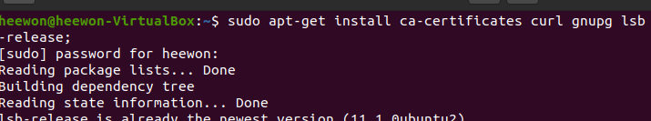
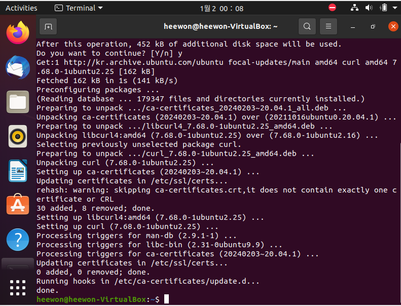

## Ubuntu, Doker 설치하기
- 리눅스 환경에서 도커를 사용해보고자 하였다.(현 PC 운영체제 : Windows)

### 1. 가상환경 설치하기
- [VirtualBox](https://www.virtualbox.org/)

### 2. Ubuntu 설치하기
- [Ubuntu 20.04.6 LTS 설치](https://releases.ubuntu.com/focal/?_ga=2.78120854.38205915.1735669801-1443926240.1735669801&_gl=1*3w29fm*_gcl_au*NDAzNDE0OTMzLjE3MzU2Njk4MDQ.)
  - Desktop image 선택
- 참고 자료 : [Inpa : 리눅스 설치방법](https://inpa.tistory.com/entry/LINUX-%F0%9F%93%9A-%EB%A6%AC%EB%88%85%EC%8A%A4-%EC%84%A4%EC%B9%98)

</br>

#### 👾 트러블 슈팅
- Virtual Box와 Ubuntu를 설치 한 후 Docker를 설치 하는 중에 아래와 같은 오류 발생
```
가상 머신을 실행하는 중 오류가 발생했습니다! 자세한 정보는 아래에 나와 있습니다. 아래에 설명된 오류를 고쳐서 가상 머신의 실행을 다시 시도할 수 있습니다.

The I/O cache encountered an error while updating data in medium &quot;ahci-0-0&quot; (rc=VERR_DISK_FULL). Make sure there is enough free space on the disk and that the disk is working properly. Operation can be resumed afterwards.

오류 ID:BLKCACHE_IOERR
심각성: 치명적이지 않은 오류
```
  - PC 하드디스크 용량 문제로 도커 설치 불가능 </br>
    => 하드디스크 정리 후 재시도하였으나 화면이 제대로 안뜸(정리해서 11G 확보된 것...)
    
    
    
    => VDI, 가상환경 삭제 후 다시 만들기(메모리, 할당크기 등 첫시도 보다 크기 키워서 설정)

    => 새로운 리눅스 환경은 설치 완료했으나 설치 후 잔여 용량이 약 2GB
    

    => 이 상황에서 도커 다시 설치하면 또 오류 발생할 것 같아서 설치 보류 : 추가 SD카드 구매 후 다시 시도 예정😂(나는 가볍게 한번 써보고 싶었던 것인데... 이렇게 막힐 줄이야)


### 3. Ubuntu에 Docker 설치하기



</br>

#### 💥 트러블 슈팅
- 리눅스 환경에서 코드 복사 붙여넣기 안됨
  - ctrl + shift + c / v로도 해결 불가
  - 메모장, SubLime Text에 붙여넣기 후 다시 복사, 붙여넣기 시도 해도 안됨
  - 마우스 우클릭 활용 복사, 붙여넣기 불가

- 해결 방법
  - VirtualBox에서 장치 > 클립보드 공유 > 양방향 설정(하는 김에 드래그 앤 드롭도 같이 양방향 설정) => 재부팅
  - 장치 > 게스트 추가 CD 이미지 삽입 선택 (이 부분은 꼭 필요한 옵션인지 모르겠다.)
    ```bash
    sudo apt update
    sudo apt install -y build-essential linux-headers-$(uname -r)

    # 재부팅
    sudo reboot
    ```

