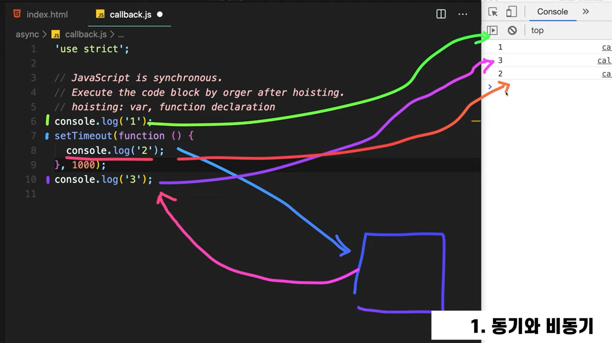
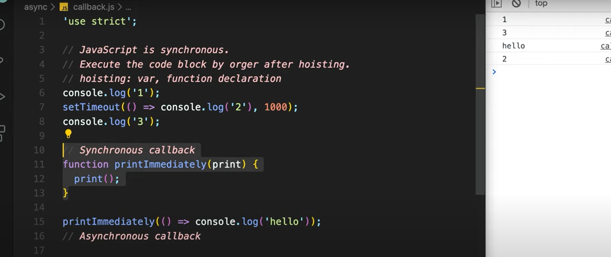
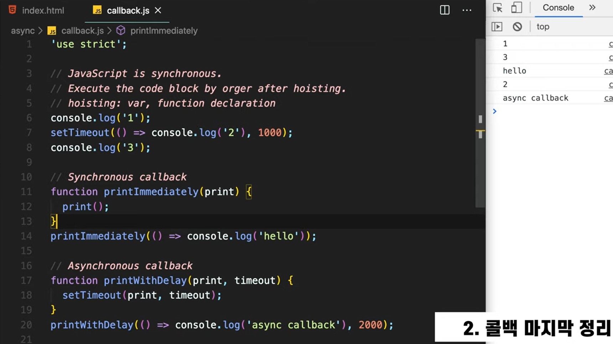
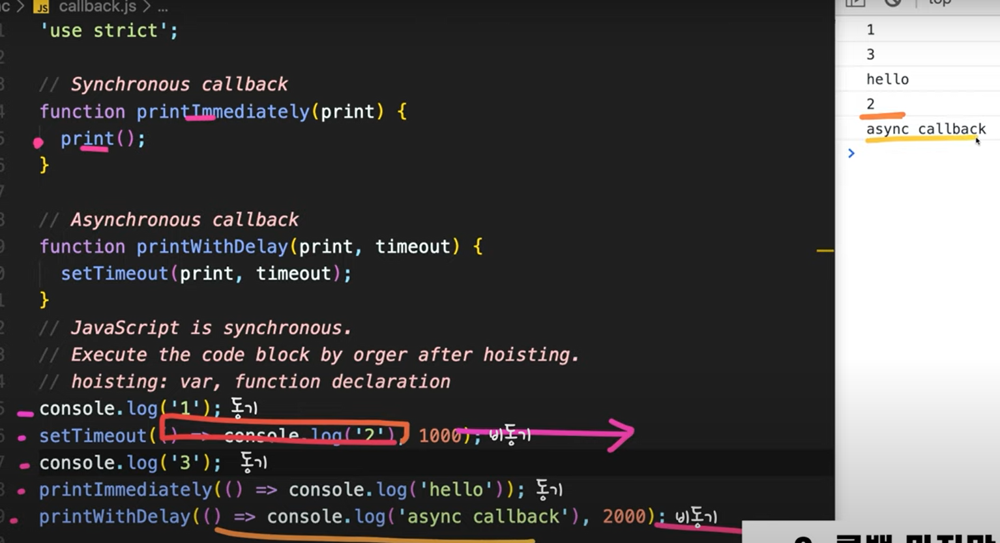
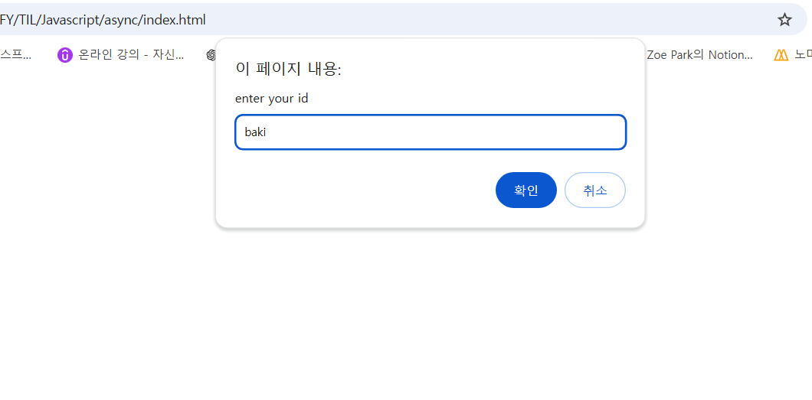
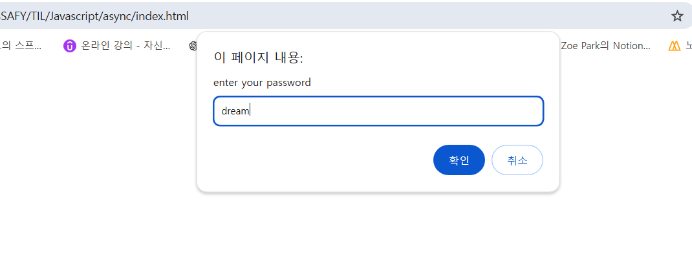
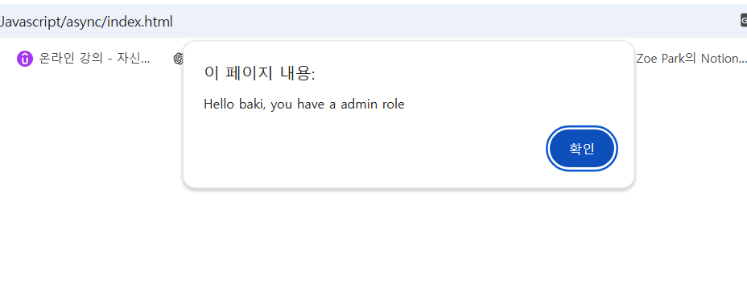
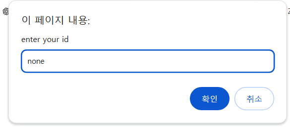
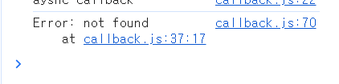

## 1. 동기와 비동기


* 1 출력 -> setTimeout 만나면 '브라우저야 너한테 요청이 하나 왔어. 1초뒤에 이 전달해준 콜백 실행해줘' -> 3 출력 -> 1초 뒤 콜백함수 실행. 2 출력

</br>

## 2. 콜백 정리

* 콜백 함수는 항상 비동기적이지 않으며, 두 가지 경우로 나눌 수 있다. 1) 즉시 동기적 실행과 2) 나중에 실행이 가능한 비동기적 실행이다.

### 1) 동기적 콜백
* 예를 들어, 특정 콜백을 받아 실행하는 함수를 만들어서 프린트하는 콜백을 전달받아 실행하도록 할 수 있다.

  ```js
  // 이 부분(함수 선언) 호이스팅
  function printImmediately(print) {
    print()
  }
  printImmediately(() => console.log('hello'))
  ```

</br>

### 2) 비동기적 콜백
* 비동기 함수는 브라우저 API를 이용하여 타임아웃과 함께 콜백 함수를 호출하는 방식으로 구현할 수 있다.
* 자바스크립트 엔진은 함수의 선언을 호이스팅하여 제일 위로 올리고, 순서대로 실행하여 결과를 출력한다.
* 자바스크립트는 함수를 다른 함수에 콜백 형태로 인자로 전달하거나 변수에 할당할 수 있으며, 다른 언어와는 다른 방식으로 콜백을 지원한다.



</br>

## 3. 콜백 지옥
```js
// 콜백 지옥 예시
// 백엔드에서 사용자 정보 가져왔다고 가정
class UserStorage {
  loginUser(id, password, onSuccess, onError) {
    // id, password 정보 일치하면 onSuccess호출, 불일치하면 onError호출
    setTimeout(() => {
      if (
        (id === "baki" && password === "dream") ||
        (id === "coder" && password === "academy")
      ) {
        onSuccess(id);
      } else {
        onError(new Error("not found"));
      }
    }, 2000);
  }

  getRoles(user, onSuccess, onError) {
    setTimeout(() => {
      // baki라면 name, role 객체 전달
      if (user === "baki") {
        onSuccess({ name: "baki", role: "admin" });
      } else {
        onError(new Error("no access"));
      }
    }, 1000);
  }
}

const userStorage = new UserStorage();
const id = prompt("enter your id");
const password = prompt("enter your password");

userStorage.loginUser(
  id,
  password,
  user => {
    userStorage.getRoles(
      user,
      userWithRole => {
        alert(`Hello ${userWithRole.name}, you have a ${userWithRole.role} role`)
      },      
      error => {console.log(error)}
    )
  },
  error => {console.log(error)}
)

```
### 3.1 ️콜백 함수 예제 코드 설명 1
- Class UserStorage에는 로그인(loginUser)과 사용자 데이터 요청(getRoles)을 위한 총 2가지 함수가 존재한다.
- loginUser는 가상의 타이머신호(setTimeout)를 사용하여 2초의 딜레이를 주고, 아이디와 패스워드를 받아 사용자가 정상적으로 로그인하면 onSuccess(콜백함수)를 호출하고, 문제가 발생할 경우 onError(에러 콜백)을 호출한다.
- getRoles는 사용자가 로그인하면 역할 정보를 받아온다. 1초의 딜레이를 두고 실행되며, 조건에 따라 성공 또는 에러 콜백을 호출한다.

### 3.2 콜백 함수 예제 코드 설명 2



- 사용자로부터 아이디와 패스워드를 입력받아 서버에 로그인 요청을 한다.
- 로그인이 성공하면 사용자의 정보를 받아오고, 이를 통해 사용자의 역할을 요청한다.
- getRoles 요청에 대한 성공 및 실패는 콜백 함수를 사용해 처리한다.


- 에러 발생 시 콘솔에 출력하고, 성공 시 사용자의 역할과 이름을 화면에 출력한다.

### 3.3 콜백 지옥의 문제점
- 콜백 지옥은 콜백함수 호출이 여러 번 중첩되면서 발생하며 코드의 복잡성을 증가시킨다.
- 이러한 구조는 가독성을 저하시키고 코드가 어떤 흐름으로 연결되어 있는지를 파악하기 어렵다.
- 비즈니스 로직을 한눈에 이해하기 힘들다. 예시 코드에서 로그인 후 사용자 역할을 확인하는 과정이 복잡하게 얽힌다.
- 에러 발생 시 디버깅이 매우 어렵고, 체인이 길어질수록 문제 분석이 복잡해진다.
- 유지 보수가 어려워진다.