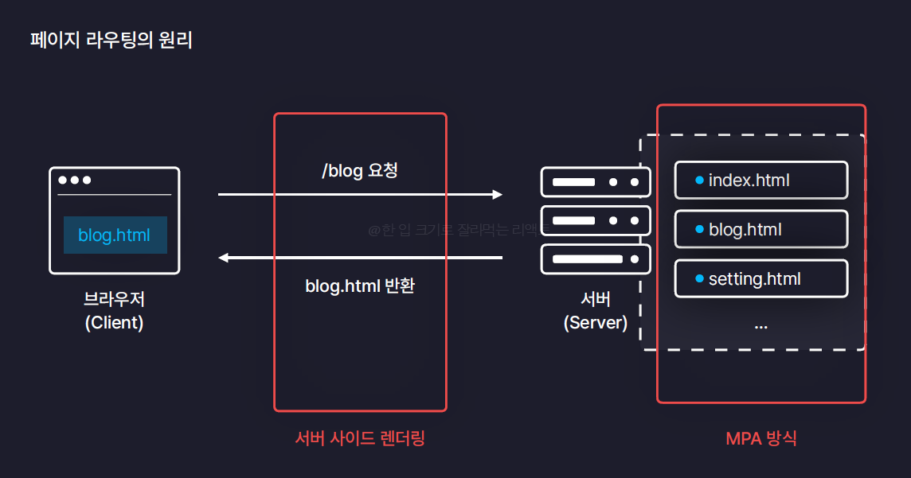

# 감정일기장 만들기

## 12.2 페이지 라우팅

- 페이지 라우팅 : 경로에 따라 알맞은 페이지를 렌더링 하는 과정


1. 서버가 사용자에게 제공해야할 모든 html 페이지 가지고 있음
2. 브라우저에서 페이지 요청
3. 서버는 해당 요청에 맞는 페이지 찾아서 반환

- Multi Page Application(MPA) : 전통적인 방식. 애초에 서버가 여러개의 페이지를 가지고 있음
- Server Side Rendering : 서버측에서 페이지를 미리 렌더링. 완성되어있는 페이지를 응답해줌

  
  => **쾌적한 페이지 이동 제공이 어렵기 때문에 React.js는 이 방식을 따르지 않음**

  이전 페이지를 제거하고 새로운 페이지를 렌더링하는 과정에서 화면 깜빡임(새로고침)

* MPA 단점

- 페이지 이동이 매끄럽지 않고 비효율적
- 다수의 사용자 접속 시 서버의 부하 심해짐

* SPA(Single Page Application)

- 페이지 이동이 매끄럽고 효율적
- 다수의 사용자가 접속해도 크게 상관 없음

* SPA의 페이지 이동

- 새로운 페이지를 매번 서버에 요청하는 MPA방식과는 달리 서버에 아무요청도 보내지 않음
- 서버로부터 받았던 React App 이용해 새로운 페이지에 필요한 컴포넌트들로 화면 교체
- React App에 모든 페이지, 컴포넌트 정보 포함되어있음
- MPA는 모든 요소를 교체하지만 **SPA는 필요한 요소만** 교체

- 무조건 index.html 반환 + Bundle JS File (React App///Vite가 Bundling)
- 브라우저가 직접 JS File 실행
- main.jsx가 가장먼저 실행 -> render함수 실행되면서 App 컴포넌트 렌더링 -> 모든 컴포넌트 렌더링

* 클라이언트 사이드 렌더링(Client Side Rendering) : 브라우저(클라이언트)에서 JS 실행해서 화면을 직접 렌더링

</br>

## 12.3 라우팅 설정하기

- React Router : 대다수의 리액트 앱이 사용하고 있는 대표적 라이브러리(npmjs.com)

1. react-router-dom 설치 : 버전 6이상
   ```bash
   npm i react-router-dom
   ```
2. main.jsx

   ```javascript
   import { BrowserRouter } from "react-router-dom";

   createRoot(document.getElementById("root")).render(
     <BrowserRouter>
       <App />
     </BrowserRouter>
   );
   ```

3. Home, New, Diary.jsx 생성
4. App.jsx에 import

</br>

## 12.4 페이지 이동

- 실습 코드 및 주석 참고
- Link 컴포넌트 : 링크 필요할 때
- useNavigate : 특정조건에 따라 페이지 이동할 때

## 12.5 페이지 라우팅 - 동적경로

- URL Parameter : '/' 뒤에 아이템의 id를 명시

  - ~/product/1, ~/product/2, ~/product/3
  - 아이템 id 등의 변경되지 않는 값을 주소로 명시하기 위해 사용

    ```javascript
    // App.jsx
    <Route path="/diary/:id" element={<Diary />} />;

    // Diary.jsx
    // useParams : 현재 브라우저에 명시한 URL Parameter의 값을 가져오는 커스텀 훅
    import { useParams } from "react-router-dom";

    const Diary = () => {
      const params = useParams();

      return <div>{params.id}번 일기</div>;
    };

    export default Diary;
    ```

- Query String : ? 뒤에 변수명과 값 명시

  - ~/search?q=검색어
  - 검색어 등의 자주 변경되는 값을 주소로 명시하기 위해 사용

  </br>

  ## 12.6 폰트, 이미지, 레이아웃 설정하기

  - public 폴더에 글꼴 넣기 -> index.css 설정
  - assets 폴더에 이미지 넣기 -> App.jsx에 import, 렌더링

  - public이나 assets 둘다 정적 파일 보관 가능

    - Vite의 이미지 최적화 설정 때문에 감정 이미지 파일은 assets에 넣음
      ```javascript
      
      ```
    - public에 보관할 경우 url로 불러올 수 있음

      ```javascript
      
      ```

      - 리액트 앱 빌드 -> 빌드된 결과물을 배포모드로 실행 -> 이미지 최적화 확인

        ```
        npm run build
        ```

        -> 빌드 후 dist 폴더 생성 : 리액트 앱 빌드 결과

        - 빌드된 결과물 실행

        ```
        npm run preview
        ```

      - assets에서 불러온 이미지들의 주소는 DATA URI(외부데이터를 문자열 형태로 브라우저 메모리에 캐싱하기 위해 사용되는 포멧)
      - 이렇게 불러온 이미지들은 자동으로 브라우저에 캐싱(저장)되어서 새로고침 하더라도 다시 불러오지 않도록 최적화
      - 일반 주소로 불러온 이미지는 새로고침 할 때마다 매번 새롭게 불러옴
        

      - 이미지 파일이 너무 많을 경우 캐싱해두면 브라우저 용량 과부하 발생할수도 있음 -> 이 경우 public폴더에 보관하는게 나을 수도
      - 실습처럼 소수의 이미지일 경우 assets에 보관하는 것이 적합

</br>

## 12.7 공통 컴포넌트 구현하기

- 버튼(긍정, 부정, 일반)
  - type에 따라 다르게 설정정
- 헤더

</br>

## 12.9 일기 관리 기능 구현하기2

- DiaryStateContext.Provider와 DiaryDispatchContext.Provider 순서 바뀌면 안되나?
  - ```javascript
    <DiaryStateContext.Provider value={data}>
      <DiaryDispatchContext.Provider value={{ onCreate, onUpdate, onDelete }}>
        <Routes>{/* 페이지 라우팅 */}</Routes>
      </DiaryDispatchContext.Provider>
    </DiaryStateContext.Provider>
    ```

</br>

## 12.12 프로젝트 회고

- 정리

  - data state에 보관될 일기 데이터들을 모든 페이지에서 이용할 수 있어야 하기 때문에 App 컴포넌트 안에 배치치
    - 리액트에서 컴포넌트간 데이터를 주고 받으려면 props거나 context. 부모에서 자식방향으로만 전달 가능
  - props drilling 방지를 위해 context 사용

  </br>

  1. Home

  - Header, DiaryList
  - Home : 이번달에 작성한 일기만 렌더링해서 DiaryList에 넘겨줌

  2. Header

  - leftChild("<"), text, rightChild(">")
  - 버튼 클릭 시 이전, 다음 달 이동

  3. DiaryList

  - menu_bar, DiaryItem
  - menu_bar : 최신순/오래된순 정렬 옵션, 새 일기 쓰기 버튼
  - DiartItem : 작성날짜, 일기내용, 수정 버튼
  - 버튼 : 컴포넌트 활용
  - 새 일기 작성, 작성된 일기 내용 확인, 수정하기 클릭 시 이동 : useNavigate

</br>

## 12.13 New 페이지 구현 (UI)

1. New

- Header
- Editor : 4가지 섹션

2. Editor

- 흰색 부분을 전부 쓸 수 없는 이유
  => body 영역 설정 문제 => body를 flex로 설정해 전체 페이지를 다 감싸도록 수정하면 해결

  ```css
  /* index.css */
  html,
  body {
    margin: 0px;
    width: 100%;
    background-color: rgb(236, 233, 233);
    display: flex;
  }
  ```

</br>

## 12.14 New 페이지 구현 (기능)

- 새 일기 쓰기 페이지(New, Editor)에서 작성완료 버튼 누르면 새로운 일기 생성

  - Editor : 사용자 입력을 input state에 보관
  - 작성 완료 버튼 클릭되면 onSubmitButtonClick 실행 -> 부모(New) 컴포넌트로 부터 받은 onSubmit 실행
  - onSubmit 함수는 App에서 받은 DiartDispatchContext에서 공급받은 onCreate 함수가 호출되면서 새로운 일기 생성

- 새 일기 작성완료 후 일기 리스트 페이지로 이동 및및 뒤로가기 방지

  - replace 옵션 true

- 새 일기 작성 취소하기

  ```javascript
  <Button onClick={() => nav(-1)} text={"취소하기"} />
  ```

- 새로고침하면 작성한 일기 사라짐
  - 저장하지 않고 있기 때문
