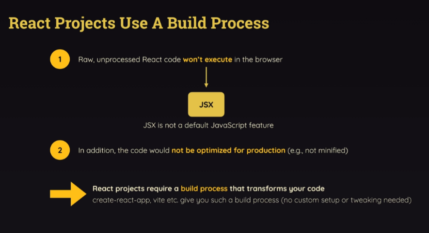
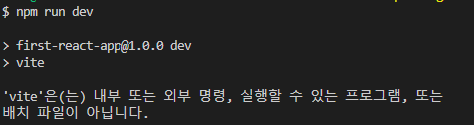

## [3] 리액트JS와 바닐라JS 비교


1. 선언형(Declarative)
* 선언형 프로그래밍은 '무엇을 해야 하는지'에 집중한다. '어떻게 할 것인지'는 프레임워크나 라이브러리가 처리한다.
* 핵심 아이디어: 결과에 집중한다. (과정을 숨김)
* 프로그래머는 "무엇을 만들고 싶은지"를 선언하고, 구체적인 DOM 조작과 같은 세부 사항은 신경 쓰지 않아도 된다.
* `리액트`는 선언형 스타일의 대표적인 예시시이다.
  * React에서의 선언형 예시
    ```jsx
      function App() {
        const [count, setCount] = React.useState(0);

        return (
          <div>
            <h1>{count}</h1>
            <button onClick={() => setCount(count + 1)}>Increase</button>
          </div>
        );
      }

      '''    
      상태(count)가 변경되면 리액트가 UI를 자동으로 업데이트한다.
      프로그래머는 '상태를 어떻게 화면에 보여줄지'만 정의하고
      DOM을 직접 수정하지 않아도 리액트가 알아서 변경 사항을 반영합니다.
      '''
    ```
</br>

2. 명령형(Imperative)
* 명령형 프로그래밍은 '어떻게 해야 하는지'에 집중하므로 작업의 각 단계를 상세히 명시해야 한다.
* 핵심 아이디어: 과정에 집중한다. (결과를 얻기 위해 수행해야 할 모든 세부사항을 작성)
* 프로그래머가 DOM 조작 등 세부적인 작업을 수동으로 처리해야 한다.
* 바닐라 자바스크립트는 명령형 스타일의 대표적인 예시이다.
  * 바닐라 자바스크립트에서의 예시
    ```javascript
    코드 복사
    const app = document.getElementById("app");
    let count = 0;

    // 초기 렌더링
    const render = () => {
      app.innerHTML = `
        <div>
          <h1>${count}</h1>
          <button id="increase">Increase</button>
        </div>
      `;

      // 이벤트 리스너 추가
      document.getElementById("increase").addEventListener("click", () => {
        count += 1;
        render(); // UI를 다시 렌더링
      });
    };

    render();
    
    '''
    프로그래머는 DOM을 수동으로 업데이트(app.innerHTML)하고, 이벤트 리스너를 명시적으로 추가한다.
    상태(count)가 변경될 때마다 화면을 다시 그리는 로직(render)을 직접 호출해야 한다.
    과정이 복잡해지고, 실수로 인해 버그가 발생할 가능성이 높아진다.
    '''
    ```
<br/>

3. 선언형과 명령형의 차이 요약

    | **특징**             | **선언형 (React)**           | **명령형 (바닐라 자바스크립트)**        |
    |:--------------------:|:---------------------------:|:--------------------------------------:|
    | **설명**             | 결과만 말함                 | 하나하나 과정까지 다 알려줘야 함         |
    | **예시1**             | "피자 만들어 줘!"           | "밀가루 섞고, 반죽하고, 오븐에 넣어!"     |
    | **예시2**             | "화면에 숫자 0을 보여줘, 그리고 버튼을 누르면 숫자가 1씩 올라가게 해줘!"           | "숫자 0을 화면에 써줘, 버튼을 만들고, 버튼을 누르면 숫자가 올라가도록 다시 화면을 바꿔줘!"     |
    | **결과**             | 쉽게 결과를 볼 수 있음       | 과정이 복잡하고 시간이 오래 걸림         |

    </br>

      | **특징**             | **선언형(Declarative)**                       | **명령형(Imperative)**                     |
      |:--------------------:|:--------------------------------------------:|:------------------------------------------:|
      | **초점**             | **결과**에 집중                              | **과정**에 집중                            |
      | **사용 편의성**      | 간단하고 직관적                               | 복잡하고 세부사항을 명시해야 함              |
      | **DOM 조작**         | 프레임워크가 처리                              | 프로그래머가 직접 DOM 조작                  |
      | **유지보수성**       | 높은 유지보수성 (코드가 간결하고 가독성 높음)  | 낮은 유지보수성 (복잡한 로직이 많아질 수 있음) |
      | **예**               | React, Vue                                   | 바닐라 JS, jQuery                           |

</br>


## 🤔 CRA와 Vite 차이
- 로컬에서 실습을 하려고 늘 그랬듯이 npm run dev를 했는데 실행이 안됐다.(코드샌드박스 이용하면 상관없음)

- 검색해서 확인해보니 실습 파일이 CRA(create-react-app)형태로 만들어져서 npm run dev 명령어가 적용이 안된 것이었다. npm start로 실행하면 3000포트로로 실행된다.
- CRA는 react-scripts를 사용한다.
  ```json
    "scripts": {
      "start": "react-scripts start",
      "build": "react-scripts build",
      "test": "react-scripts test --env=jsdom",
      "eject": "react-scripts eject"
    },
  ```
  - Vite를 사용했다면 package.json에서 vite 의존성이 포함되어있고, scripts부분에 "dev: "vite"라고 되어있다.
    ```json
    "devDependencies": {
      "vite": "^x.x.x",
      "@vitejs/plugin-react": "^x.x.x"
    }
    ```

    ```json
    "scripts": {
    "dev": "vite",
    "build": "vite build",
    "preview": "vite preview"
    }
    ```
  ### CRA와 Vite의 차이점 정리

  | **특징**             | **CRA (Create React App)**                   | **Vite**                                    |
  |----------------------|----------------------------------------------|---------------------------------------------|
  | **초점**             | 간단한 설정으로 React 앱 생성                 | 빠른 개발 서버와 번들링 속도                  |
  | **속도**             | 느린 초기화 및 빌드                           | 빠른 초기화 및 빌드                          |
  | **설정 변경**        | 기본 설정 강제 (CRA 환경에서 변경 어려움)       | 설정 파일 (`vite.config.js`)로 자유롭게 변경 가능 |
  | **개발 서버 실행 명령** | `npm start`                                  | `npm run dev`                               |
  | **지원 프레임워크**   | React 전용                                   | React, Vue, Svelte, Preact 등 다양한 프레임워크 지원 |

</br>

## [14] 리액트 프로젝트 구축 프로세스

- 리액트 프로젝트는 빌드 프로세스를 사용한다. 작성한 코드가 그대로 브라우저에서 실행되는 것이 아니다. 내부적으로 코드가 수정된다.
```javascript
// package.json
react-scripts 패키지는 브라우저에 전달되기 전에 뒤에서 코드를 변환하는 다양한 툴을 제공한다. => 전달된 HTML 파일에 script 태그를 추가한다.
```

* 리액트 프로젝트가 빌드 프로세스를 이용하는 이유(왜 코드를 변환해야 하는가)


1. 처리되지 않은 리액트 코드는 브라우저에서 실행 불가
  - 리액트 코드는 JSX(자바스크립트 파일에 작성된 html 코드) 사용하기 때문
2. 작성한 코드가 프로덕션을 위해 최적화되지 않았기 때문
  - ex. 간소화되지 않은 경우


cra, vite 등으로 프로젝트 생성하면 자동으로 빌드 프로세스 들어있음. Node.js는 설치해야함

## [15] import와 export
- 자바스크립트는 import 시 확장자 입력해야하지만 리액트는 빌드 프로세스로 인해 자동으로 확장자 추가해줌

- JS에서 import/export를 사용하려면 index.html에서 scrtip 태그에 type="mlodule" 로 해야함
ㅏ React에서는 빌드 프로세스가 import export 키워드가 있는 개별 파일을 모두 합쳐 하나의 큰 파일을 만든 다음 기존 문법을 순서대로 사용해 처리 => 브라우저가 여러개의 작은 자바스크립트 파일을 다운로드 하지 않고 몇개의 큰 파일을 다운로드 하면 됨(효율적)

* export default
  - 파일별로 하나만 존재 가능
    ```javascript
    export default apikey
    import apikey from "./util.js"
    ```
* export
  - 여러개 가능
    ```javascript
    export let apikey="abab"
    export let ccc="ccc"
    import { apikey, ccc } from "./util.js"
    ```
* 자바스크립트 객체로 묶어서 한번에 import 가능
  ```javascript
  import * as util from "./util.js"
  ```