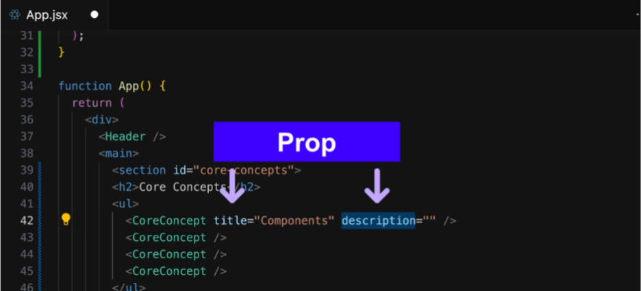
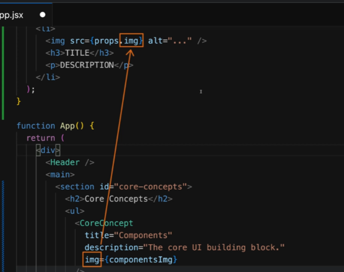

## [37] JSX와 리액트 컴포넌트
- 자바스크립트 문법 확장자
- HTML 마크업 코드를 작성하여 HTML 요소를 설명하고 생성할 수 있게 한다.
- 브라우저에는 사용 불가
  - 브라우저에 도달하기 전에 개발 서버에서 변환


* 리액트에서 컴포넌트로 인식되려면
  1. 함수의 제목이 대문자로 시작 
  2. 함수에서 렌더링 가능한 값이 반환되어야 함. (대체로 렌더 될 HTML 마크업 반환)

</br>

## [40] 리액트의 컴포넌트 처리 과정 & 컴포넌트 트리 생성법
- 커스텀 컴포넌트는 리액트에게 내장된 컴포넌트가 아니라는 것을 알리기 위해 대문자로 시작해야함
- head image div 같은 내장 컴포넌트는 리액트에서 DOM 노드로서 렌더링 됨
- 커스텀 컴포넌트는 단순한 함수이므로 반환된 값, JSX 코드를 사용해 코드를 분석하고 특정 시간이 지나면 내장요소만 남게 되고 이들이 화면에 렌더링 됨

### [퀴즈]

- JSX의 목적 : 컴포넌트로부터 생성되어야 하는 타켓 HTML 코드를 더 쉽게 정의할 수 있도록 한다.
- JSX 코드는 타겟 UI/HTML 코드를 정의하기 위해 사용된다.
- `JSX 코드는 트리모양의 코드 구조를 띄며 리액트에게 각 컴포넌트들이 어떻게 연관되어 있고 UI는 어떻게 보여야 하는지 알려준다. 그 다음 올바른 명령어를 실행하여 실제 DOM을 제어하며 타겟 구조/코드를 반영한다.`

- 커스텀 컴포넌트는 JSX 코드 내 HTML 요소처럼 사용된다.
- 커스텀 컴포넌트는 자바스크립트 함수로 생성될 수 있다.
- JSX에서 커스텀 컴포넌트를 사용하라면 첫문자가 대문자여야 한다.
- 커스텀 컴포넌트는 무조건 렌더링할 수 있는 내용을 반환해야한다.(주로JSX)
- 커스텀 컴포넌트는 어디에든 정의할 수 있다.(사용하려는 컴포넌트 옆X)


</br>

### [추가 자습]
* 🤔 JSX는 어떻게 컴퓨터가 이해할까?
  - JSX로 만든 코드는 컴퓨터가 바로 이해하지 못한다. React가 "이 코드를 진짜 HTML로 바꿔야겠군!" 하고 변환을 도와줌
  - React는 이 JSX 코드를 보고 HTML 구조를 만들고 컴퓨터 화면에 그려 준다.


- js
  ```js
  // React.createElement를 사용해서 HTML 태그를 하나씩 만듦
  // 코드 길고 보기 어려움움
  const element = React.createElement(
  'div', 
  null, 
  React.createElement('h1', null, '안녕, React!')
  );

  ReactDOM.render(element, document.getElementById('root'));
  ```

- jsx
  ```jsx
  // HTML처럼 작성할 수 있어서 더 직관적이고 깔끔
  const element = (
  <div>
    <h1>안녕, React!</h1>
  </div>
  );

  ReactDOM.render(element, document.getElementById('root'));
  ```
</br>

## [41, 42] 동적 데이터 / 파일
- 동적 데이터는는 `{}` 중괄호 이용해서 전달한다.
- src/assets에 있는 이미지는 import해서 불러온다.
  - img 태그의 src에 이미지 주소만 입력해도 되긴하지만 배포과정에서 이미지가 손실될 수 있다.

</br>

## [43] Prop(속성)으로 컴포넌트 재사용


  - props로 전달하는 키(속성)와 컴포넌트에서 사용하는 키가 같아야한다.

</br>

## [44] Props 대체 문법
1.
- 스프레드 연산자를 이용해서 객체 데이터의 키값 한번에 가져올 수 있다.
    ```jsx
    import { CORE_CONCEPTS } from './data.js';
    .
    .
    .
      <ul>
        <CoreConcept
          title={CORE_CONCEPTS[0].title}
          description={CORE_CONCEPTS[0].description}
          image={CORE_CONCEPTS[0].image}
        />
        <CoreConcept {...CORE_CONCEPTS[1]} />
        <CoreConcept {...CORE_CONCEPTS[2]} />
        <CoreConcept {...CORE_CONCEPTS[3]} />
      </ul>
    ```

2.
- 매개변수 목록에서 사용되는 중괄호는 html요소에서 사용되는 중괄호와 상관없다.
- js 구조분해는 들어오는 객체의 속성들을 이름별로 목표로 한다. props에서 동일한 속성 사용해야함.
  ```jsx
  export default function CoreConcept({ image, title, description }) {
    return (
      <li>
        
        <h3>{title}</h3>
        <p>{description}</p>
      </li>
    );
  }
  ```

