## [1] 타입스크립트란?

* 타입스크립트
  - 자바스크립트의 상위 집합으로, 타입을 명시할 수 있는 프로그래밍 언어이다.
  - 코드를 작성할 때 변수나 함수의 타입을 정해줌으로써 오류를 미리 잡을 수 있도록 도와준다.

* 자바스크립트
  - 웹 페이지에 생동감을 주는 매우 인기 있는 프로그래밍 언어이다.
  - 브라우저에서 사용되며, 대부분의 웹사이트에서 동적 요소를 만들기 위해 사용된다. **하지만 자바스크립트는 타입을 강제하지 않기 때문에 개발 중에 오류가 숨겨질 수 있어 디버깅이 어려울 수 있다.**

 

### 1. 타입스크립트를 사용하는 이유
타입스크립트는 자바스크립트로 변환되어야 하며, 이를 통해 여러 가지 장점을 제공한다.
-  자바스크립트는 잘못된 인자 타입을 사용할 경우 오류를 사전 단계에서 알리지 않기 때문에 개발자가 실수할 수 있다.
- 타입스크립트는 이러한 문제를 개발자가 예상하지 못한 오류를 런타임 이전에 발견하도록 돕는다. 
  - 자바스크립트(동적언어) : 런타임에 타입결정 / 오류 발견
  - 자바, 타입스크립트(정적언어) : 컴파일 타임에 타입 결정/오류 발견
- 타입스크립트는 정적 타입 언어로 컴파일 시점부터 타입 검사가 이루어진다.
코드 작성 시 초기 고려 사항이 많아지지만 이는 코드 작성의 안정성을 높이고, 작업 속도를 빠르게 하는 데 기여한다.
타입스크립트의 특징으로 인해 신뢰할 수 있는 코드를 작성할 수 있다.

 

### 3. 타입스크립트 플레이그라운드 활용하기
타입스크립트를 작성해 볼 수 있는 공간은 타입스크립트 플레이그라운드로, 별도의 설치 없이 코드 작성과 변환된 JavaScript 확인이 가능하다.
코드 작성 시, 타입스크립트는 타입을 알 수 없으면 기본적으로 any 타입으로 판단하며, 이는 사용자의 실수를 반영하는 것이다.
any 타입을 대신하기 위해 특정 타입을 지정해야 하며, 예를 들어 number 타입으로 고정하면 불필요한 오류 메시지를 줄일 수 있다.
인수의 개수가 맞지 않으면 에러 메시지가 출력되며, 이는 타입스크립트가 개발자의 실수를 감지하고 알리는 기능이다.
코드 작성 시, 불필요한 타입을 사용하지 않고 하나의 타입으로 고정하면 더 나은 코드 품질을 유지할 수 있음을 강조한다.

3.1. ️ 타입스크립트 플레이그라운드 사용법
타입스크립트 코드를 작성하고 변환된 JavaScript를 확인할 수 있는 공간이 있다.
구글에서 '타입스크립트 플레이그라운드'를 검색하면 쉽게 접근할 수 있다.
코드 작성 시 즉시 피드백이 제공되며, 오류가 발생하면 빨간 줄로 표시된다.
타입스크립트는 타입이 명확하지 않을 경우 any 타입으로 간주하지만, 가능한 사용을 자제해야 한다.
인수의 수가 잘못되었을 때는 타입스크립트가 오류 메시지를 제공하며, 이는 개발자의 실수도 감지한다.

3.2. 타입스크립트에서의 타입 규정
숫자를 받기 위해 add 함수를 작성하였으며, 이 함수는 숫자 타입의 인수를 요구한다.
타입 정의를 완료한 후에는 원하는 타입을 명시해야 한다.
이전에 괜찮았던 문자열 'hello'가 에러로 나타나는 이유는 애니타입이 제거되고, 인수가 넘버로 고정되었기 때문이다. [3-26]

3.3. ️ 타입스크립트의 에러 처리 및 타입 정의
두 개의 인수가 필요한 상황에서 하나만 제공되었을 때, 에러 메시지가 출력되는 현상이 발생한다.
타입스크립트가 아닌 개발자의 실수로 인해 발생하는 에러로 인식된다. [3-31]
매개변수의 개수에 따라 3개를 전달했을 경우에도 에러 메시지가 표시된다. [3-32]
기본적으로 매개변수의 타입을 숫자로 고정하여 인해, 주어진 인수의 타입이 맞지 않을 경우 에러로 반영된다.
모든 인수가 적절히 수정되지 않으면 코드 사용이 불가능해진다. [3-42]

4. 타입 지정의 중요성
함수를 만들 때 인수들의 타입을 지정하는 방법이 있으며, 이는 코드의 안정성을 높인다.
매개변수의 타입을 명확히 지정함으로써 다른 사람이 만든 함수를 사용할 때 어떤 타입으로 전달해야 하는지를 쉽게 이해할 수 있다.
코드의 오류를 미리 감지할 수 있어 수정해야 할 부분을 사전에 알아차릴 수 있다.
타입 스크립트는 브라우저에서 코드를 실행할 때 오류가 있는 코드를 그대로 보여 주며, 이해를 돕는다.
사용법을 명확하게 알림으로써 제대로된 사용이 가능하게 한다.

## [2] 기본 타입
1. 💡 타입스크립트의 기본 타입
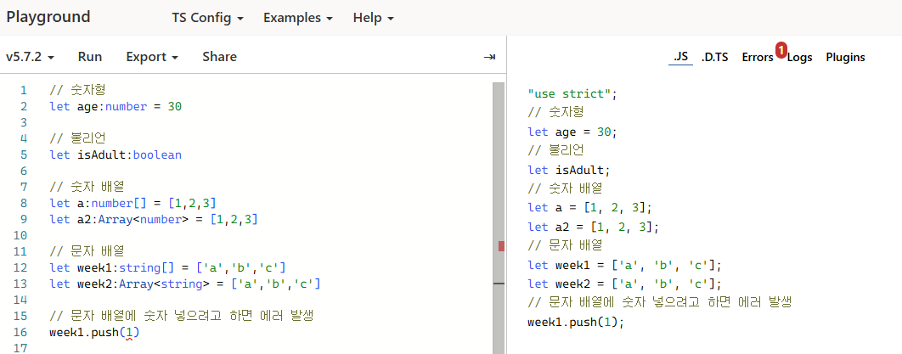
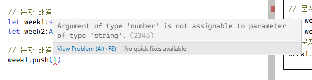

문자 타입은 스트링으로 선언하며, 변수에 값을 쌓을 수 있다. [1-2]
스트링이 아닌 다른 타입으로 선언할 경우 에러가 발생한다. [1-6]
타입스크립트는 타입을 자동으로 인식하여 명시적으로 선언할 필요가 없다. [1-7]
다양한 타입에 대해 추가적으로 살펴볼 예정이다. [1-10]

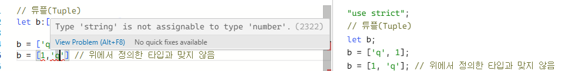
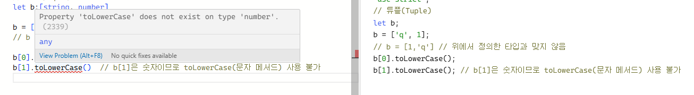

2. 📊 타입스크립트의 기본 타입 이해하기

불린 타입은 true 또는 false 값으로, 기본적인 논리 연산을 수행하는데 사용된다.
배열의 각 요소는 숫자로 이루어져 있으며, 각각의 값을 개별적으로 접근하고 처리할 수 있다.
문자열에 대해서는 `trim()` 메서드를 사용하여 공백을 제거할 수 있다.
인덱스 별로 타입이 다를 수 있으며, 예를 들어 문자열과 넘버를 같이 사용할 수 있다.

타입스크립트는 타입을 사전에 정의함으로써 코드 작성 시 에러를 피할 수 있게 도와준다.

3. 💻 타입스크립트에서의 기본 타입 설명

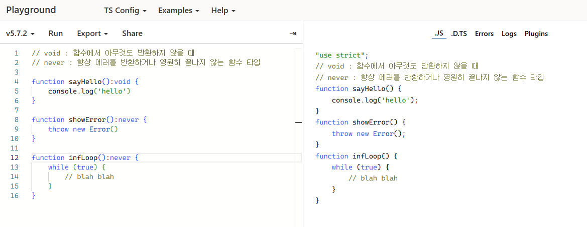

void는 함수에서 아무것도 반환하지 않을 때 주로 사용되며, 이는 입력 시 아무것도 바라지 않는 상황을 나타낸다.
void는 항상 에러를 반환하거나 영원히 끝나지 않는 암시적인 타입으로 사용될 수 있다.
다음으로 소개되는 타입은 이넘(enumeration) 타입으로, 자바를 경험한 사람들에게 익숙한 자바스크립트의 타입이다.[3-5]
이넘 타입은 비슷한 값끼리 묶여 있다는 특징이 있다.[3-7]

4. 🖥️ 이넘(Enums) 사용법과 활용
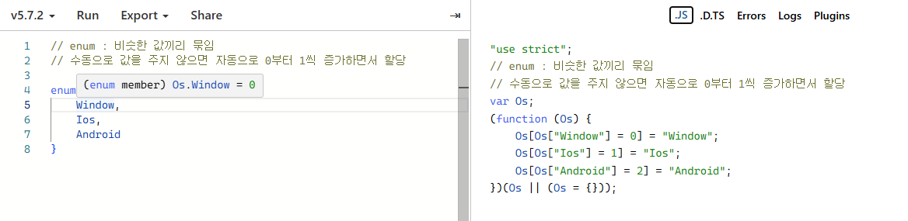
이넘은 값이 자동으로 0부터 1씩 증가하며 할당된다. 기본적으로 첫 번째 값은 0으로 시작된다. 
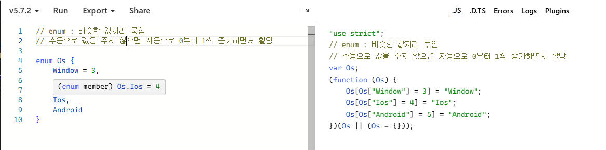
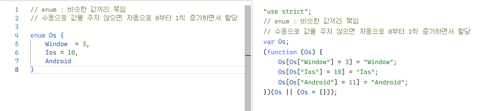
수동으로 값을 지정할 수 있으며, 예를 들어 iOS를 10으로 바꾸면 다른 값들이 자동으로 조정된다. [4-5]
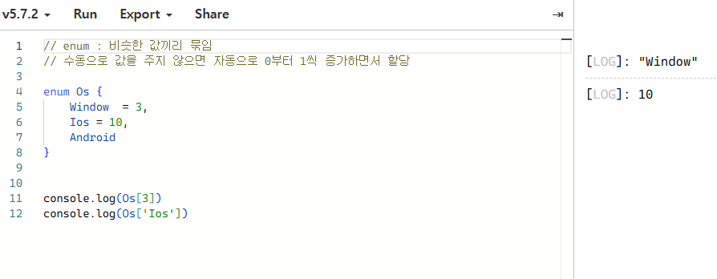
양방향 매핑 되어있다.

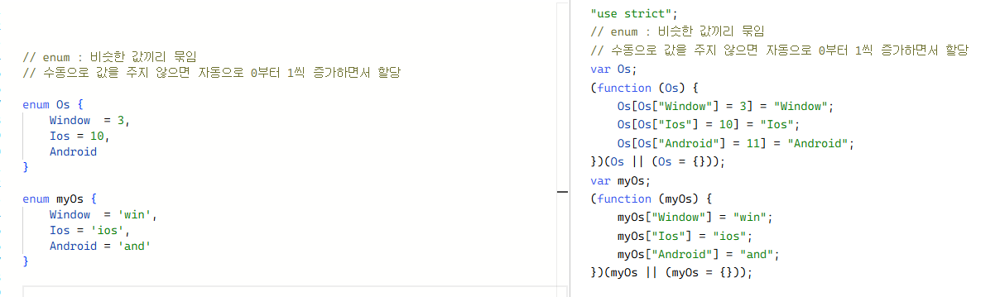
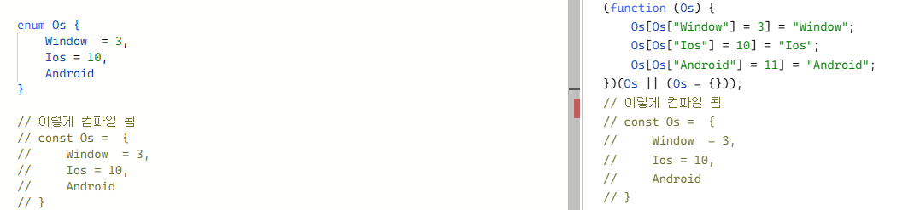
이넘은 숫자뿐만 아니라 문자열 값도 입력할 수 있고, 단방향 매핑이다. 이를 통해 다양한 값을 지정할 수 있다. [4-13]
특정 값들만 입력하도록 제한해주고 싶을 때 이넘을 사용하면 유용하다.
이넘을 통해 코드의 가독성과 관리가 용이해지며, 특정 값들에 대한 공통점을 강조할 수 있다.
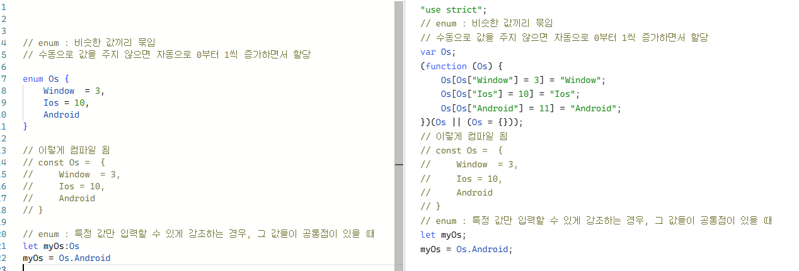
 

5. 타입스크립트의 null과 undefined
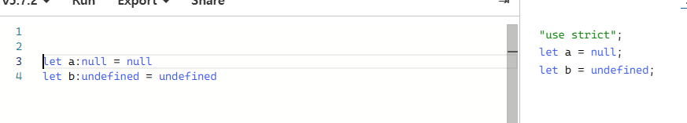
null은 특별한 값으로, 변수에 값이 없음을 나타낸다.
undefined는 변수가 선언되었으나 값이 할당되지 않은 상태를 의미한다.
null과 undefined 각각의 용도를 이해하고 사용할 수 있다.
